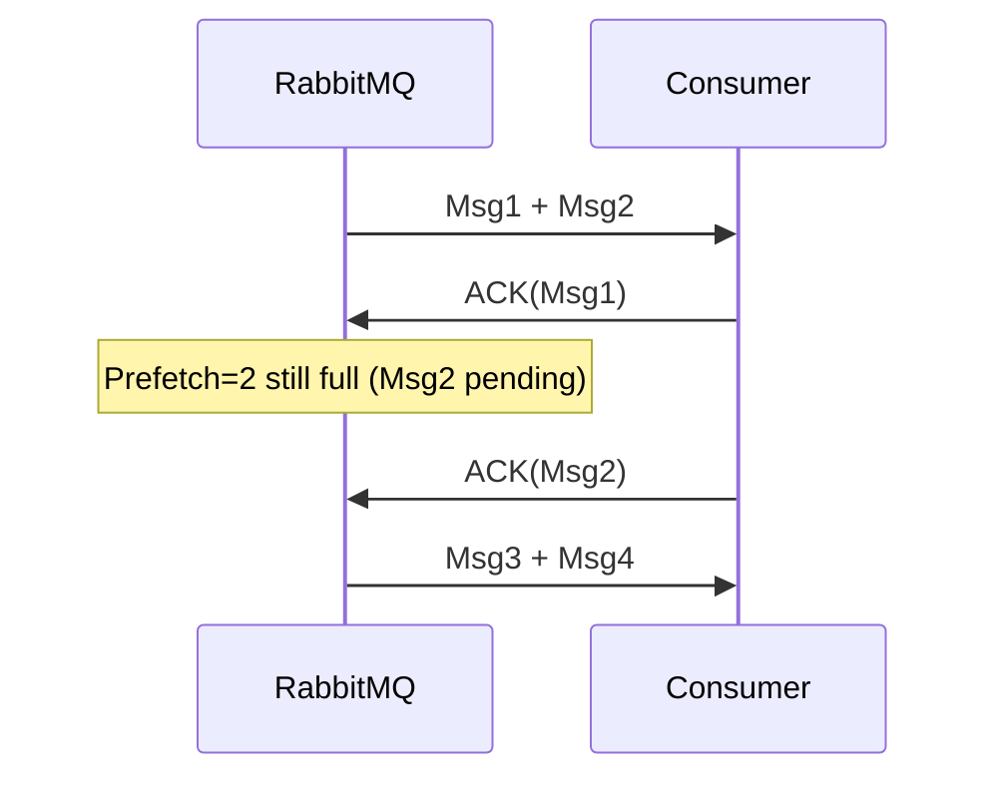
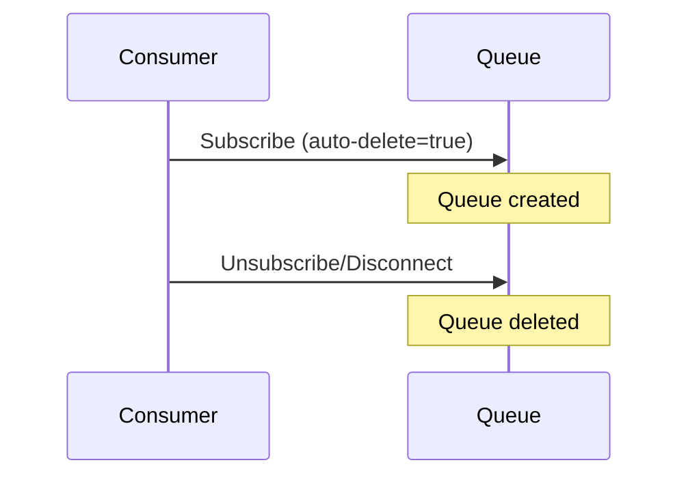

# RabbitMQ Guide

## 1. What is RabbitMQ?

RabbitMQ is an open-source **message broker** that implements **AMQP (Advanced Message Queuing Protocol)**. It decouples producers (senders) and consumers (receivers) using exchanges, queues, and bindings to manage asynchronous communication.

## 2. What is a Queue in RabbitMQ?

A queue is a buffer that stores messages until they are consumed. Each message is delivered **at most once** unless requeued manually.

## 3. What is an Exchange?

An exchange receives messages from producers and routes them to queues based on **binding rules** and **routing keys**. Types include **direct**, **fanout**, **topic**, and **headers**.

## 4. How does RabbitMQ differ from Kafka?

RabbitMQ focuses on **message brokering and routing**, supports multiple protocols like AMQP, and is great for **task queues**. Kafka is optimized for **high-throughput log data**, **stream processing**, and **event sourcing**.

## 5. Explain the AMQP model in RabbitMQ

The AMQP model consists of **producers**, **exchanges**, **queues**, **bindings**, and **consumers**. Messages go from producers → exchanges → queues (via bindings) → consumers.

## 6. What are the types of Exchanges in RabbitMQ?

- **Direct**: Routes to queues by exact routing key match
- **Fanout**: Broadcasts to all bound queues
- **Topic**: Uses pattern-matching with * and #
- **Headers**: Routes by header values (less common)

## 7. What is prefetch in RabbitMQ?
prefetch limits the number of unacknowledged messages a consumer can receive. It helps balance load and avoid overwhelming consumers.

## 8. How do message acknowledgments work in RabbitMQ?
Consumers acknowledge messages using ack. If a consumer dies before acking, RabbitMQ re-queues the message (if autoAck is false).

## 9. What is the difference between durable, persistent, and auto-delete queues?
- **Durable**: Queue survives broker restart.
- **Persistent**: Message survives restart (only if queue is durable).
- **Auto-delete**: Queue is deleted when the last consumer disconnects.

