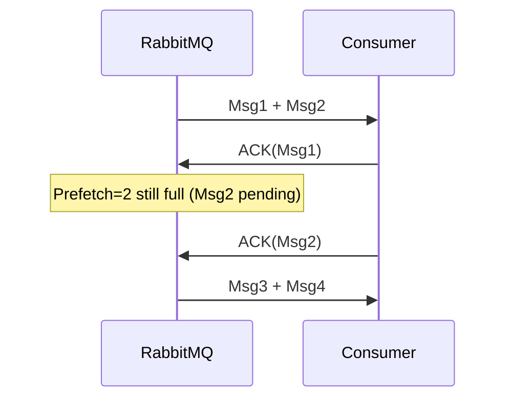
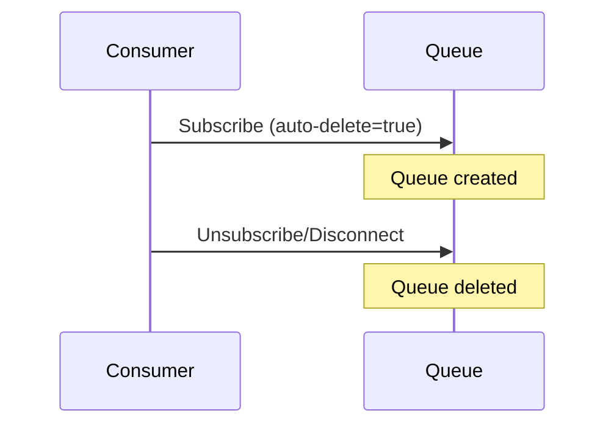

# RabbitMQ Guide

## Table of Contents

1. [What is RabbitMQ?](#1-what-is-rabbitmq)
2. [What is a Queue in RabbitMQ?](#2-what-is-a-queue-in-rabbitmq)
3. [What is an Exchange?](#3-what-is-an-exchange)
4. [How does RabbitMQ differ from Kafka?](#4-how-does-rabbitmq-differ-from-kafka)
5. [Explain the AMQP model in RabbitMQ](#5-explain-the-amqp-model-in-rabbitmq)
6. [What are the types of Exchanges in RabbitMQ?](#6-what-are-the-types-of-exchanges-in-rabbitmq)
7. [What is prefetch in RabbitMQ?](#7-what-is-prefetch-in-rabbitmq)
8. [How do message acknowledgments work in RabbitMQ?](#8-how-do-message-acknowledgments-work-in-rabbitmq)
9. [What is the difference between durable, persistent, and auto-delete queues?](#9-what-is-the-difference-between-durable-persistent-and-auto-delete-queues)
10. [How does dead-lettering work in RabbitMQ?](#10-how-does-dead-lettering-work-in-rabbitmq)
11. [What are the differences between basic.nack, basic.reject, and basic.ack?](#11-what-are-the-differences-between-basicnack-basicreject-and-basicack)
12. [How do you handle message retries in RabbitMQ?](#12-how-do-you-handle-message-retries-in-rabbitmq)
13. [What is a consumer tag?](#13-what-is-a-consumer-tag)
14. [Can you explain mirrored queues (HA queues)?](#14-can-you-explain-mirrored-queues-ha-queues)

---

## 1. What is RabbitMQ?
RabbitMQ is an open-source **message broker** that implements **AMQP (Advanced Message Queuing Protocol)**. It decouples producers (senders) and consumers (receivers) using exchanges, queues, and bindings to manage asynchronous communication.

## 2. What is a Queue in RabbitMQ?
A queue is a buffer that stores messages until they are consumed. Each message is delivered **at most once** unless requeued manually.

## 3. What is an Exchange?
An exchange receives messages from producers and routes them to queues based on **binding rules** and **routing keys**. Types include **direct**, **fanout**, **topic**, and **headers**.

## 4. How does RabbitMQ differ from Kafka?
RabbitMQ focuses on **message brokering and routing**, supports multiple protocols like AMQP, and is great for **task queues**. Kafka is optimized for **high-throughput log data**, **stream processing**, and **event sourcing**.

## 5. Explain the AMQP model in RabbitMQ
The AMQP model consists of **producers**, **exchanges**, **queues**, **bindings**, and **consumers**. Messages go from producers → exchanges → queues (via bindings) → consumers.

## 6. What are the types of Exchanges in RabbitMQ?
- **Direct**: Routes to queues by exact routing key match
- **Fanout**: Broadcasts to all bound queues
- **Topic**: Uses pattern-matching with * and #
- **Headers**: Routes by header values (less common)

## 7. What is prefetch in RabbitMQ?
prefetch limits the number of unacknowledged messages a consumer can receive. It helps balance load and avoid overwhelming consumers.

## 8. How do message acknowledgments work in RabbitMQ?
Consumers acknowledge messages using ack. If a consumer dies before acking, RabbitMQ re-queues the message (if autoAck is false).

## 9. What is the difference between durable, persistent, and auto-delete queues?
- **Durable**: Queue survives broker restart.
- **Persistent**: Message survives restart (only if queue is durable).
- **Auto-delete**: Queue is deleted when the last consumer disconnects.

## 10. How does dead-lettering work in RabbitMQ?
If a message is rejected, expired, or cannot be routed, it can be sent to a **Dead Letter Exchange (DLX)** for further inspection or retry logic.

## 11. What are the differences between basic.nack, basic.reject, and basic.ack?
- **basic.ack**: Acknowledge successful processing.
- **basic.reject**: Reject a single message (optionally requeue).
- **basic.nack**: Reject one or more messages (bulk option), with requeue control.

## 12. How do you handle message retries in RabbitMQ?
Use **Dead Letter Exchanges** and **TTL (Time-To-Live)** to delay and retry messages. Implement exponential backoff with retry queues.

## 13. What is a consumer tag?
A consumer tag uniquely identifies a consumer instance. Useful when unsubscribing or managing consumers programmatically.

## 14. Can you explain mirrored queues (HA queues)?
Mirrored queues replicate messages across nodes in a cluster. If one node fails, another can take over with no data loss. Replaced by **quorum queues** in newer RabbitMQ versions.
